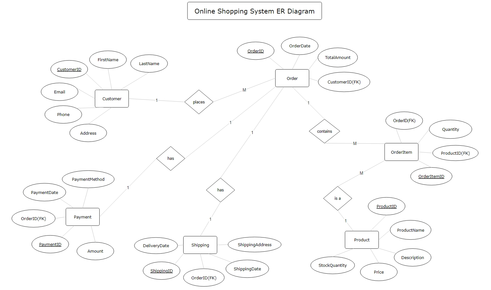

# Online Shopping System

## Description

This project implements an **online shopping system database** using MySQL. It manages customers, products, orders, payments, and shipping information.

The purpose of this project is to showcase a simple database design using ER modeling and SQL. The system supports common e-commerce features, like customer management, product listings, and order processing.

## Features

-   **Customer Management**: Add and manage customer details.
-   **Product Catalog**: Maintain a catalog of products.
-   **Order Processing**: Create orders and track products sold.
-   **Payments**: Handle payments for each order.
-   **Shipping Information**: Track shipping addresses and delivery dates.

## ER Diagram

## Database Structure

-   **Customer**: Stores customer details.
-   **Product**: Holds product information.
-   **Order**: Stores order details.
-   **OrderItem**: Details the products in each order.
-   **Payment**: Records payments for orders.
-   **Shipping**: Manages shipping addresses and delivery details.
